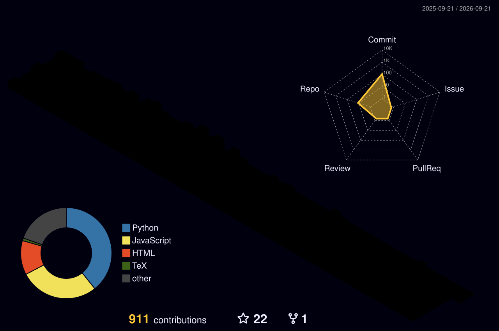

<!-- ======= HERO BANNER (animated gradient) ======= -->

  

<!-- ======= TYPING EFFECT ======= -->

  

<!-- ======= QUICK LINKS ======= -->

  
  
  

<!-- ======= IDENTITY LINE ======= -->

  <b>MSCS @ NYU · NYC</b> 
  Gaming Nerd I Am.

<!-- ======= CORE STACK ======= -->

  

<!-- ======= DOMAIN SNAPSHOT ======= -->

  
  
  
  

<!-- ======= CONTRIBUTION SNAKE (animated) ======= -->

  <i>This snake is powered entirely by caffeine and maybe commit history.</i>

  

  Why are these too short?

  

